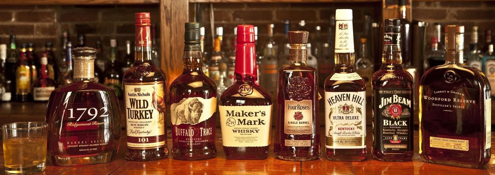
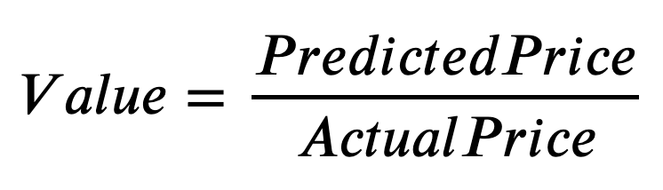

# Identifying Value For Money In The World Of Whisky!

  

### 1.	Overview
This capstone project was completed as part of the General Assembly Data Science Immersive bootcamp. The purpose was to investigate the factors affecting whisky prices, to make predictions based on the data, and to identify opportunities following exploration and modeling of the data.

### 2.	Hypothesis
My aim was to help whisky buyers make better informed decisions when purchasing whisky. Consider the following formula:

<kbd></kbd>

My hypotheses are therefore:
* Can a regression model be developed to accurately predict the price of whisky given various features of the whisky such as age, vintage, country of origin, alcohol content etc.?
* Can I identify whiskies that provide the best value for money?

### 3.	Business Problem
Whiskies with a Value greater than 1 represent those that are underpriced, and the higher the Value the more underpriced the whisky is. This could have a significant impact on large whisky purchasers as they can buy better quality whiskies at lower prices. This can either be used to increase profit margins, increase customer satisfaction (by offering better value for money), or some combination of the two depending on the business' requirements. This problem can be generalized to any retail business involved in the buying and selling of goods.

### 4.	Data Acquisition
The information used in this project was obtained from Hard To Find Whisky (htfw.com), a retail website selling over 6,500 different whiskies. I performed a web scrape of the data over multiple csv files that were then appended together and loaded into a single dataframe.

Following cleaning (described in next chapter) the following features were obtained:

| Feature | Explanation |
| :- | :- |
| Distillery | The company producing the whisky. |
| Series | The edition. Typically, a single distillery will produce numerous whiskies. |
| Cask Strength | A term used to describe a whisky that has not been substantially diluted after its storage in a cask. |
| Cask Type	| Not only refers to the wood used for the cask, but whether the cask is new or previously used. |
| Single Cask | Whether the whisky is drawn from one individual cask. |
| Packaging | How the item is packaged. |
| Bottler | Whether the whisky is bottled at the distillery it is made, or at an independent bottler. |
| Country | The country in which the whisky is produced. |
| Stopper | How the whisky bottle is sealed. |
| Description | A description of the whisky including any tasting notes or special points of interest. |
| Bottle Size | The volume of the bottle measured in centilitres (100cL = 1L). |
| Vintage | The year the distilling process commenced. |
| Year Bottled | The year the whisky was bottled. |
| Age | The number of years the whisky spent distilling in the cask. |
| Alcohol content | Alcohol is contained in a given volume. |
| Price | The whisky price – my target variable! |

### 5.	Data Cleaning
Generally, the data required extensive cleaning before it could be used in a meaningful way. Besides fairly standard cleaning operations, some notable cleaning include:
* Series and Description features were subset for Natural Language Processing (NLP),
* Symbols and special characters were removed from all remaining features, and they were converted to appropriate data types,
* Using the relationship Year Bottled = Vintage + Age I was able to impute missing values,
* IterativeImputer was used for remaining missing values for these three features, and
* Outliers were removed using percentiles (values <1% and >99% were removed).

The final dataset comprised 16 features and 5,660 whiskies.

### 6.	Exploratory Data Analysis
The EDA process provided valuable insight into the different features, and the relationships between them.

It was important to understand the distribution of price as this was my intended target variable in the predictive models to come. It was immediately clear that the prices in my data were not normally distributed and were highly skewed to the right. Even after removing outliers, my average whisky price was about £540, with a minimum price of £30 and a maximum price of £10,000. 

<kbd></kbd>

<i>Figure 1: Histogram of whisky prices. Note that the distribution is not normal.</i>

Figure 1 shows that the majority of whisky prices are significantly less than the maximum value! I used a logarithmic transformation to make it uniformly distributed.

Having transformed my target feature, I was able to move on to exploring my predictor features. Using Tableau, I was able to produce a plot showing the number of whiskies obtained. I was able to get whiskies from 17 different countries, although 90% were obtained from Scotland. Figure 2 therefore shows the distribution of whiskies excluding Scotland. The countries from which I obtained the most whiskies include Scotland, Ireland, Japan, England, USA and India.

<kbd></kbd>

<i>Figure 2: Whisky distribution across the world (excluding Scotland).</i>

Next, I investigated the relationship between some of the numeric features against price. Figure 3 shows the relationship between the selected numeric features and price. There is a somewhat linear relationship between the features and price. Generally, the older the whisky, and the longer it was been aged for, the higher the price. This makes sense as it is what we would expect.

<kbd></kbd>

<kbd></kbd>

<kbd></kbd>

<i>Figure 3: Unit Price plotted against Vintage, Year Bottled, and Age.</i>

I also investigated the relationship between some of the categorical features against average price to get an idea of how certain features could affect price. Figure 4 shows the relationship between selected categorical features and average price. 

Considering the binary features (Cask Strength, Single Cask and Bottler) there was a stronger effect on price if the whisky was cask strength or single cask. The similarity in the average price whether the whisky was bottled by the distillery or an independent bottler indicates this feature does not seem to have a significant impact on price.

<kbd></kbd>

<i>Figure 4: Average price plotted against several categorical features.</i>

Finally, with detailed text information captured in both the Description and Series features, I hoped to gain insight through visualization of these text features using word clouds. I removed common stop words as well as common words related to whisky. This process proved to be an invaluable way to learn the language of whisky.

Figure 5 shows the 200 most common words contained in the Description text (bottle) and the 100 most common words in the Series text (glass). While the series tends to use words such as “Single Cask”, “Single Malt”, Connoisseurs Choice”, and “Edition”, the description tends to use words associated with flavours or aromas such as “sweet”, “rich”, “vanilla, “spice”, and “smoke”.

<kbd></kbd>
<kbd></kbd>

<i>Figure 4: Average price plotted against several categorical features.</i>

